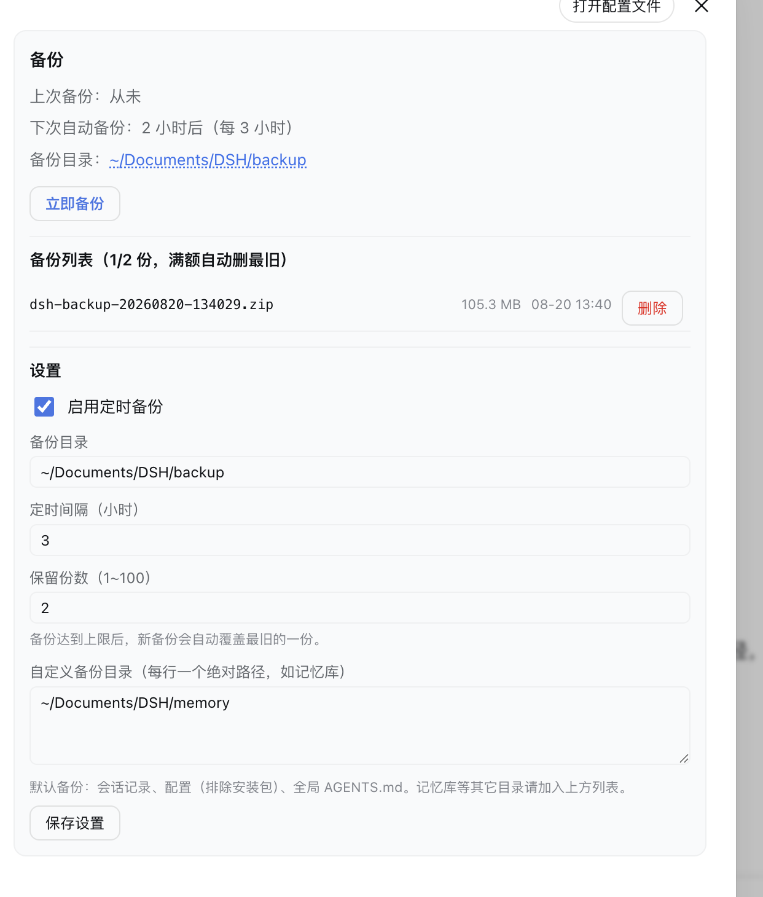

# dsh-backup 📦

[English](README.md) | [简体中文](README.zh-CN.md)


*Unofficial project: independently developed and maintained by a community member, not an official DeepSeek product.*

Automated backups of your DSH data — sessions, profile config and any custom directories — packed into `.zip` archives with scheduled or manual runs and automatic rotation.

## Screenshot



| Action | Effect |
|---|---|
| Scheduled backup | Packs DSH data on a timer (default every 6 h) |
| Manual backup | One-click "Back up now" from the Settings page |
| Custom directories | Add extra paths (e.g. your memory library) per line |
| Rotation | Keeps only the latest N archives (default 10), old ones are deleted |
| Restore | Manual only — extract an archive back to its original location (steps in `docs/install.md`) |

**What is backed up by default:** `~/.dsh/sessions` (conversation history), `~/.dsh/profiles` (config, **excluding** `node_modules`), `~/.dsh/AGENTS.md` (global conventions). Everything else — like your memory library — goes into the custom directory list.

## Install

```bash
dsh plugin --profile web add "github:a903067276-rgb/dsh-backup#main"
```

Then restart `dsh web`. Manual fallback: `docs/install.md`.

## Usage

Open **Settings → Backup**:

- Status row: last backup / next scheduled run / backup folder
- **Back up now** button
- Backup list: name, size, time, delete
- Settings: backup folder, schedule toggle + interval (hours), retention count, custom directories (one absolute path per line)

## Platform support

| Platform | Status |
|---|---|
| macOS | ✅ tested |
| Linux | ✅ expected (pure Node, no system zip required) |
| Windows | ✅ expected (pure Node, no system zip required) |

## Requirements

- DSH web >= 0.1.0-rc.7
- **rc.6 users:** install the frozen `rc6-compat` tag instead: `dsh plugin add github:a903067276-rgb/dsh-backup#rc6-compat` (no maintenance; upgrade to rc.7+ recommended)
- Node.js ≥ 16.7 (bundled with DSH)

## How it works

- **Host:** a zero-dependency zip packer (`lib/zip.js`, pure Node streams — no system `zip`, no shell, immune to the session sandbox), a `timer`-driven schedule, and a `/api/dsh-backup/*` route for the Settings page.
- **Client:** one Settings section (`settings.section`, "备份") that lists backups and edits configuration; saving writes the config back into the profile's `cordis.patch.yml` (takes effect after restart).

## Notes

- Restore is intentionally manual: stop DSH, extract the archive over the original paths, and keep the current data around until you are sure the restore is correct. The plugin never overwrites anything by itself.
- The backup folder defaults to `~/Documents/DSH/backup` and can be changed in Settings.
- Only backups the plugin owns (`dsh-backup-*.zip`) are listed/deleted — other files in the folder are left alone.

## License

MIT
